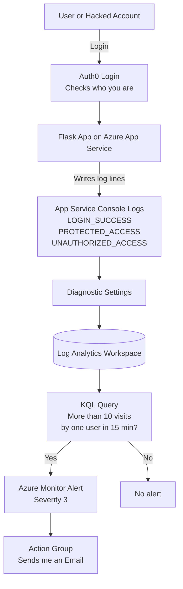

# CST8919 - DevOps Security and Compliance
## Assignment 1: Securing and Monitoring an Authenticated Flask App

**Name:** Divyang Lodariya  
**Student ID:** 041267894  
**Course:** CST8919 - DevOps: Security and Compliance  

---

## 🎥 Demo Video

**YouTube Link:** _[https://youtu.be/KasxcJxWDfs?si=yOV4XFY7N6Lgd_DX]_

---

## 1. What This Project Does 

This project takes two things I built earlier and joins them together:

- **Lab 1** gave the app a **login** using Auth0 (so the app knows *who* the user is).
- **Lab 2** gave the app **monitoring** using Azure (so I can *see what users do* and get an email if something looks wrong).

In Assignment 1, I combined both into one real, working app:

1. A user logs in with Auth0.
2. The app writes a **log line** every time the user logs in, opens a protected page, or tries to open a protected page without logging in.
3. Those logs are sent to **Azure Log Analytics**.
4. A **KQL query** looks for any user who opens the protected page **more than 10 times in 15 minutes** (this could be a hacked account).
5. If that happens, **Azure sends me an alert email automatically**.

That’s the whole idea: **know who the user is, watch what they do, and get warned when they do too much.**

---

## 2. How It Works (Architecture Diagram)



**Reading the diagram left to right:** the user logs in through Auth0, the app records what they do, those records flow into Azure Log Analytics, a query checks for suspicious behaviour, and if it finds it, I get an email.

---

## 3. The App Routes

| Route | What it does |
|-------|--------------|
| `/` | Home page - shows Login or Logout |
| `/health` | Simple public "is the app alive?" check |
| `/login` | Sends the user to Auth0 to log in |
| `/callback` | Auth0 sends the user back here after login → logs `LOGIN_SUCCESS` |
| `/protected` | The sensitive page → logs `PROTECTED_ACCESS` (login required) |
| `/logout` | Logs the user out |

---

## 4. Logging

Every important action writes **one log line** in a fixed, easy-to-read format so my query can read it later:

```
LOGIN_SUCCESS       user_id=auth0|xxxx  email=user@example.com  ip=1.2.3.4
PROTECTED_ACCESS    user_id=auth0|xxxx  email=user@example.com  path=/protected  ip=1.2.3.4
UNAUTHORIZED_ACCESS user_id=anonymous   email=unknown           path=/protected  ip=1.2.3.4
```

**Two small but important things I had to handle:**

- **Log levels:** Flask’s logger ignores `info` messages by default, so I set the level manually to make sure my logs actually appear.
- **Real IP address:** Azure App Service sits behind a proxy, so the app first sees the proxy’s IP instead of the user’s. I used **ProxyFix** and read the `X-Forwarded-For` header to get the user’s real public IP.

---

## 5. Detection Logic (KQL Query)

This query finds **any user** who opened `/protected` **more than 10 times in the last 15 minutes**, and shows their `user_id`, the last time they accessed it, and the count:

```kql
AppServiceConsoleLogs
| where TimeGenerated > ago(15m)
| where ResultDescription has "PROTECTED_ACCESS"
| extend user_id = extract(@"user_id=([^\s]+)", 1, ResultDescription)
| where isnotempty(user_id)
| summarize AccessCount = count(), LastAccess = max(TimeGenerated) by user_id
| where AccessCount > 10
| project user_id, LastAccess, AccessCount
| order by AccessCount desc
```

**How the query works, line by line:**

- `where TimeGenerated > ago(15m)` → only look at the last 15 minutes.
- `where ResultDescription has "PROTECTED_ACCESS"` → keep only protected-page visits.
- `extract(...)` → pull the `user_id` out of the log line. I used `[^\s]+` (not `\w+`) because the user_id contains a `|` symbol, and `\w+` would cut it off and break the grouping.
- `summarize ... by user_id` → count visits **for each user separately** (this is the key part - it tells a real attacker apart from a normal user).
- `where AccessCount > 10` → only show users over the limit.

**Result:** the busy "suspicious" user shows up; the normal "analyst" user (only 3 visits) does not. This proves the query counts **per user**, not just total rows.

---

## 6. Alert Logic

I turned the query above into an automatic Azure Monitor alert:

| Setting | Value |
|---------|-------|
| Scope | Log Analytics workspace |
| Measure | Table rows → Count |
| Granularity | 15 minutes |
| Check frequency | Every 5 minutes |
| Split by dimension | `user_id` (so the alert tells me *which* user triggered it) |
| Threshold | Greater than 0 rows |
| Severity | **3 (Low)** |
| Action | Action Group → sends me an **email** |

When one user goes over 10 visits, the alert fires and emails me — including the exact `user_id` that caused it.

---

## 7. Repository Structure

```
CST8919-Assignment1/
│
├── app.py              # Main Flask app (Auth0 login + logging)
├── requirements.txt    # Python packages needed
├── .env.example        # Example config (NO real secrets)
├── test-app.http       # Test requests for valid and invalid access
├── README.md           # This file
│
└── templates/
    ├── home.html       # Home page
    └── protected.html  # Protected page
```

---

## 8. Setup Instructions

### Step 1 - Auth0
1. Create a **Regular Web Application** in Auth0.
2. Add these **Allowed Callback URLs**:
   ```
   http://localhost:3000/callback, https://<your-app>.azurewebsites.net/callback
   ```
3. Add these **Allowed Logout URLs**:
   ```
   http://localhost:3000, https://<your-app>.azurewebsites.net
   ```

### Step 2 - Run Locally
```bash
python -m venv venv
venv\Scripts\activate
pip install -r requirements.txt
```
Then copy `.env.example` to `.env` and fill in your own values. Generate the secret key with:
```bash
python -c "import secrets; print(secrets.token_hex(32))"
```
Run the app:
```bash
python app.py
```
Open **http://localhost:3000**

### Step 3 - `.env.example` contents
```
AUTH0_CLIENT_ID=your_client_id_here
AUTH0_CLIENT_SECRET=your_client_secret_here
AUTH0_DOMAIN=your-tenant.auth0.com
APP_SECRET_KEY=your_64_character_hex_string_here
COOKIE_SECURE=false
PORT=3000
```

### Step 4 - Deploy to Azure
- Deployed to **Azure App Service** (Linux, Python 3.12), running with **gunicorn**.
- Auth0 secrets are stored as **App Settings** in Azure (never in the code).
- Set `COOKIE_SECURE=true` and `PYTHONUNBUFFERED=1` for the cloud version.
- Enabled **App Service Console Logs** and sent them to **Log Analytics** using **Diagnostic Settings**.

---

## 9. How to Test

Use `test-app.http` (with the VS Code REST Client extension), or:

- **Valid access:** log in through the browser, then click "Access Again" more than 10 times to trigger the alert.
- **Unauthorized access:** send a request to `/protected` with no login — the app returns a redirect and logs `UNAUTHORIZED_ACCESS`.

---

## 10. Reflection

**What worked well:**
- Writing logs in a simple `key=value` format made the KQL query very easy to write.
- Using ProxyFix and `X-Forwarded-For` gave me the user’s real IP address instead of the proxy’s.
- Splitting the alert by `user_id` meant the alert email told me exactly which user to investigate.
- Testing with a busy "suspicious" user and a quiet "analyst" user proved my detection counts **per user**, not just total activity.

**What I would improve:**
- Log in **JSON format** and read it with `parse_json()` instead of regex — it’s more reliable.
- Also group by **source IP**, not just user, to catch attacks that spread across many usernames.
- Ignore known safe office IPs to reduce false alarms.
- Add **rate limiting** in the app itself — detection *reports* an attack, but a rate limit actually *stops* it.

---

*Submitted for CST8919 - DevOps: Security and Compliance.*
